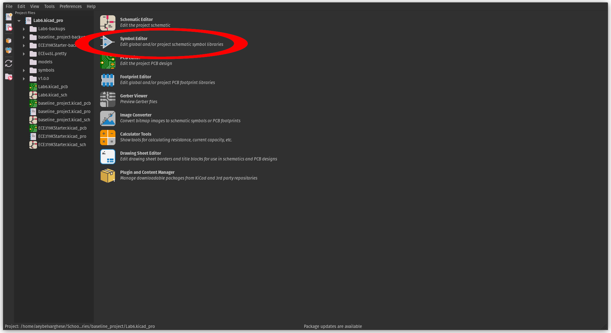
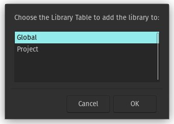
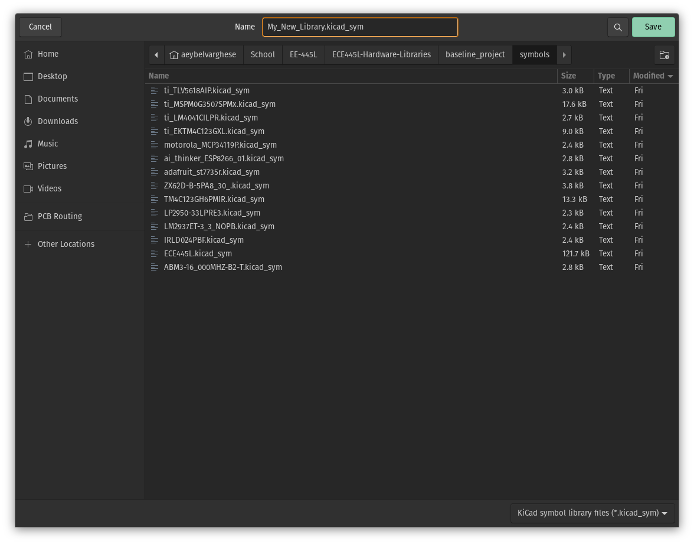
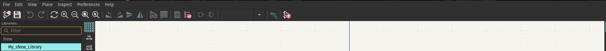
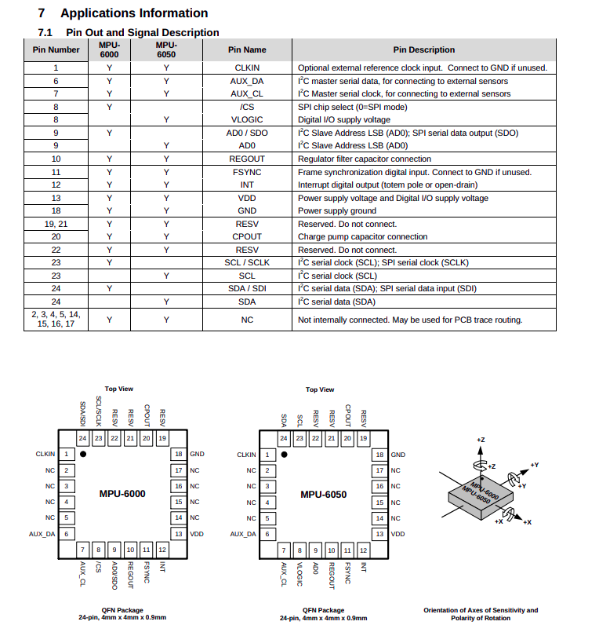
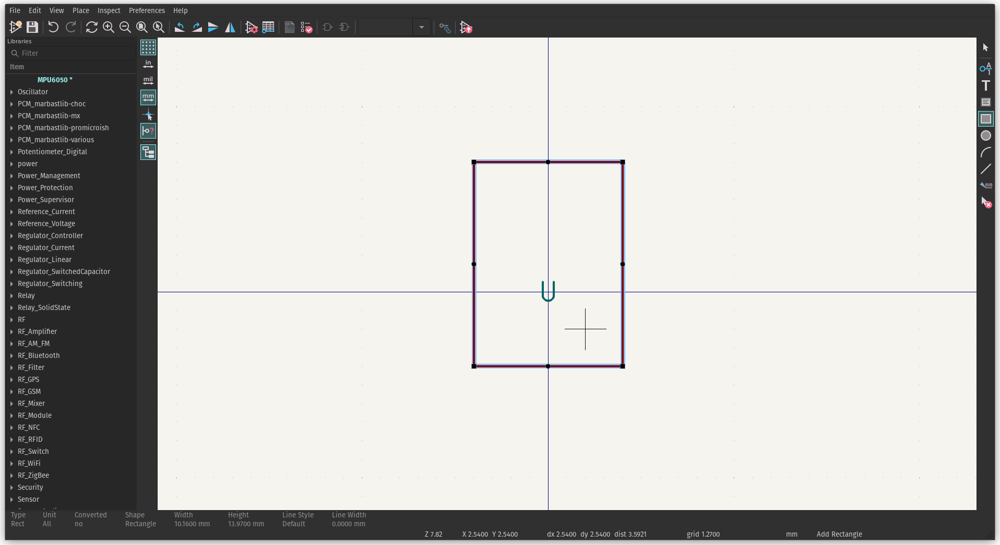
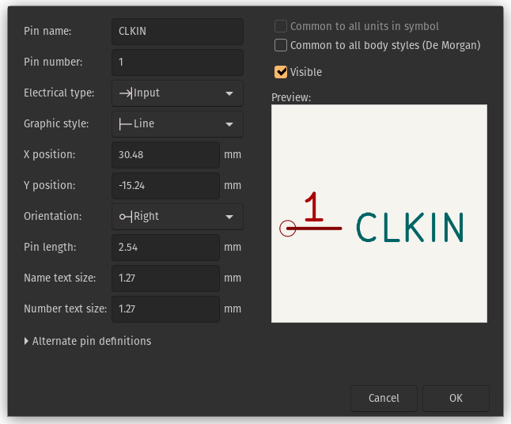
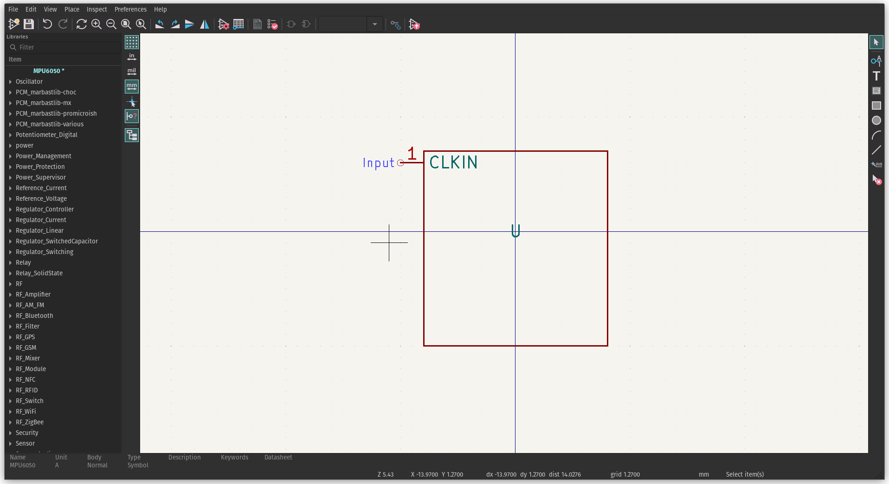
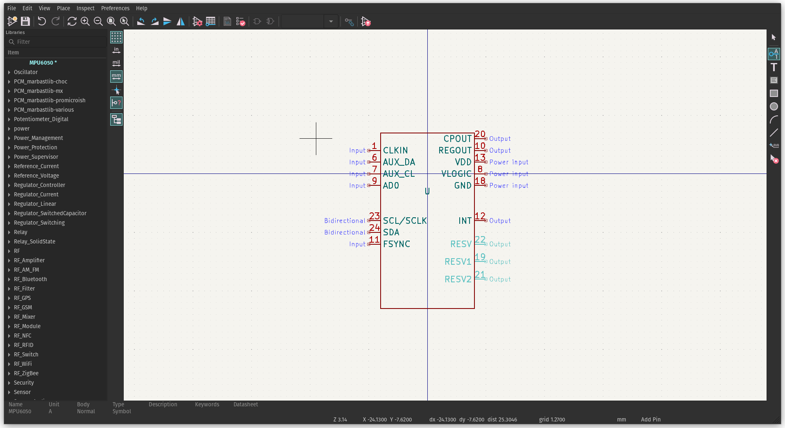

---
papersize:
- a4
geometry:
- margin=1in
---

# Creating Custom Symbols

\tableofcontents
\newpage

## Introduction

KiCad is a powerful open-source software suite for electronic design automation (EDA). It offers a comprehensive set of tools for schematic capture and PCB layout. While KiCad comes with an extensive library of symbols and footprints, there are times when you may need to create custom symbols and footprints to suit specific components or devices not available in the standard libraries or online.

Creating custom symbols allows you to represent components accurately in your schematics, while custom footprints enable precise placement and routing of PCB components.

## Creating a Custom Symbol

A symbol in KiCad represents a component on your schematic. Every component on a schematic must be precisely represented to ensure the functionality and reliability of the final product. While KiCad offers a vast library of pre-made symbols, there are instances where designers encounter unique components or specialized devices not covered by the standard offerings.

To create a symbol, open the symbol editor.

The KiCad Symbol Editor is a tool within the KiCad software suite specifically designed for creating and editing schematic symbols. It provides a user-friendly interface for designing graphical representations of electronic components, which are then used in schematics to illustrate circuit connections and layouts.

The Symbol Editor offers a graphical canvas where users can draw and manipulate schematic symbols using various drawing tools such as lines, arcs, polygons, and text boxes. The Symbol Editor allows users to save custom symbols to libraries for future use in other projects. Libraries can be organized and managed within KiCad to ensure easy access to custom symbols and efficient reuse across designs. Refer to the resource on adding libraries on more information regarding libraries.

When creating a symbol, it must be part of a library. We can either select a library to append a symbol to, or create a new library. To create a library, navigate to $\text{File}\rightarrow\text{New Library}$, from here we can decide which symbol library table we want to add to, the global or project.

The global library table is shared amongst all your KiCad projects, while the project table is only for your currently open project. For this writeup, I am going to be adding it to the Project Table. When you press Ok, you can choose the location to save the ".kicad_sym" file which will contain your symbol library. You can choose any location you wish, although it is reccomended to have a folder dedicated for symbols organized in a reasonable matter. There is a "footprints" folder in the baseline project, and I will be storing the symbol library there. A entry in the symbol library table will be automatically made.

With a library selected in the left pane, press the "New Symbol Icon" or the Keyboard shortcut "N" to create a new symbol

Provide a name for the symbol, I am going to be creating a symbol for the [MPU6050](https://invensense.tdk.com/wp-content/uploads/2015/02/MPU-6000-Datasheet1.pdf), a IMU (Intertial Measurement Unit) from TDK InvenSense.

Creating symbols in KiCad involves designing graphical representations of electronic components to be used in schematics. Referring to datasheets during this process is crucial for accurately capturing the component's electrical characteristics and pin configurations.

Referring to the pinout, we notice there are three categories of pins for this specific IC: power, communication, and miscellaneous pins. We want to include all of these in our symbol. KiCad provides tools in the side toolbar to draw basic geometric shapes and describe pins.

Lets start by using the box tool to define the shape of our symbol.

With the shape of our pin assigned lets start adding pins. Select the "Add a Pin" button on the side toolbar, or press "P".

When you press "Add a pin" in the KiCad Symbol Editor, you are prompted with several options to configure the properties of the pin being added to the symbol. These options allow you to define the electrical characteristics and behavior of the pin within the schematic symbol. 

1. **Name**: This field allows you to specify the name of the pin, which is typically a descriptive label indicating the function or purpose of the pin within the component. Refer to the datasheet of the component for the name

2. **Number**: Here, you can assign a unique number to the pin. Pin numbers are used to identify individual pins within the symbol and are often based on the component's datasheet or industry standards.

3. **Orientation**: This option determines the direction in which the pin is oriented within the symbol. You can choose from various orientations such as left, right, up, down.

4. **Length**: Specifies the length of the pin's graphical representation within the symbol. This helps to visually distinguish pins of different lengths and aids in aligning pins with their corresponding connection points in the schematic.

5. **Electrical Type**: Defines the electrical characteristics of the pin, such as whether it is an input, output, bidirectional, power, or other special types. Selecting the appropriate electrical type ensures correct behavior during circuit simulation and layout as well as good for organization.

6. **Visible**: Determines whether the pin is visible or hidden in the symbol. Hidden pins are often used for internal connections or other purposes where the pin should not be displayed on the schematic.

7. **Pin Function**: This option allows you to specify additional information about the pin's function or behavior, such as whether it is a clock input, reset signal, or other specialized function. This information aids in documentation and understanding the purpose of each pin within the symbol.

Once we submit the options  for the pin, we can place the pin down on our symbol.

After adding our pins, this is what our final symbol look like.

